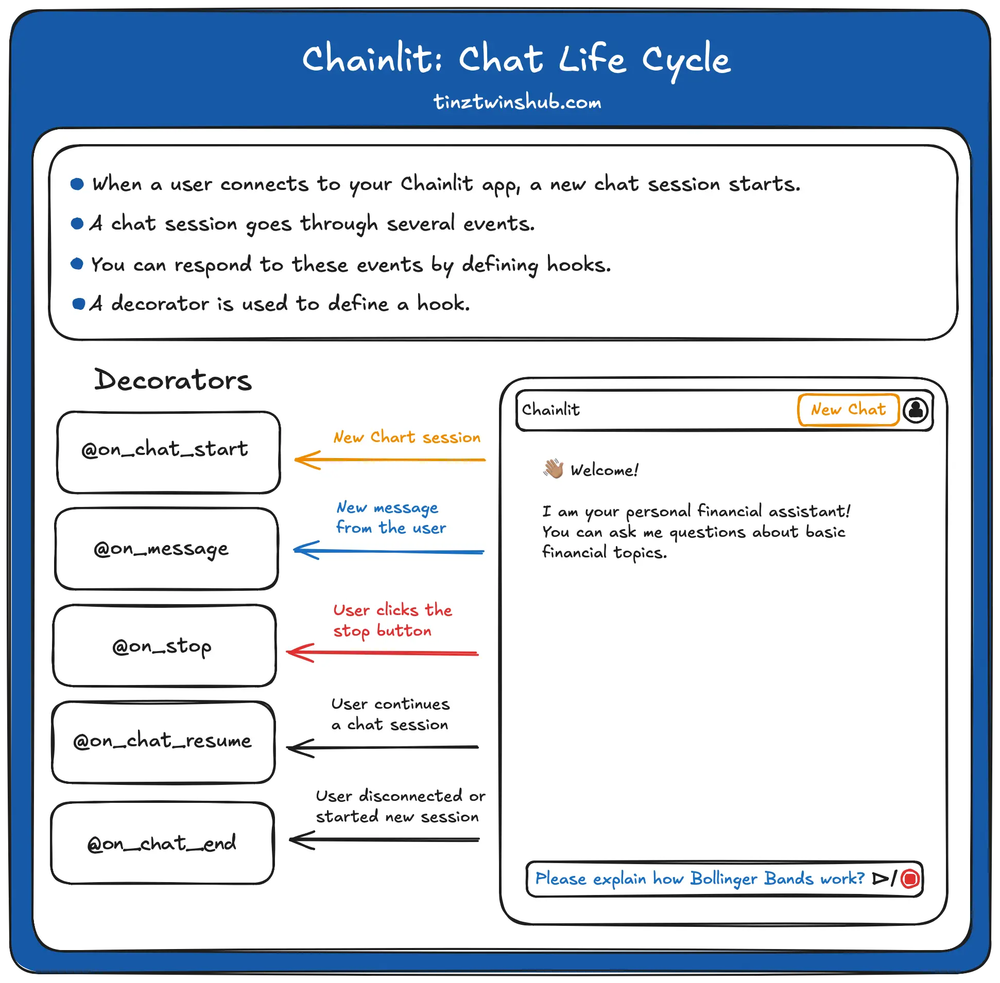

# Simple Chatbot

A simple chatbot application built with Python, UV, and Chainlit.



## Getting Started

### 1️⃣ Install UV

First, install **UV** (if not already installed):

```sh
curl -LsSf https://astral.sh/uv/install.sh | sh
```

For Windows:

```sh
powershell -ExecutionPolicy ByPass -c "irm https://astral.sh/uv/install.ps1 | iex"
```

Verify installation:

```sh
uv --version
```

---

### 2️⃣ Create and Initialize the Project

```sh
uv init simple-chatbot
cd simple-chatbot
```

---

### 3️⃣ Install Chainlit (Dependency)

```sh
uv add chainlit
```

---

### 4️⃣ Activate UV Virtual Environment (Windows)

```sh
.venv\Scripts\activate
```

For Linux/macOS:

```sh
source .venv/bin/activate
```

### 5️⃣ Try Chainlit Hello

Run the following command to check if Chainlit is installed and working:

```sh
chainlit hello
```

Go to the following URL:

```sh
http://localhost:8000
```

Enter your name and send the message

You should see the following output:

```sh
Your name is: Asharib / Your Name
Chainlit installation is working!
You can now start building your own chainlit apps!
```

---

### 6️⃣ Run Simple Chatbot

```sh
chainlit run main.py -w
```

🎉 That’s it! Your Simple Chatbot is ready to use 🚀
