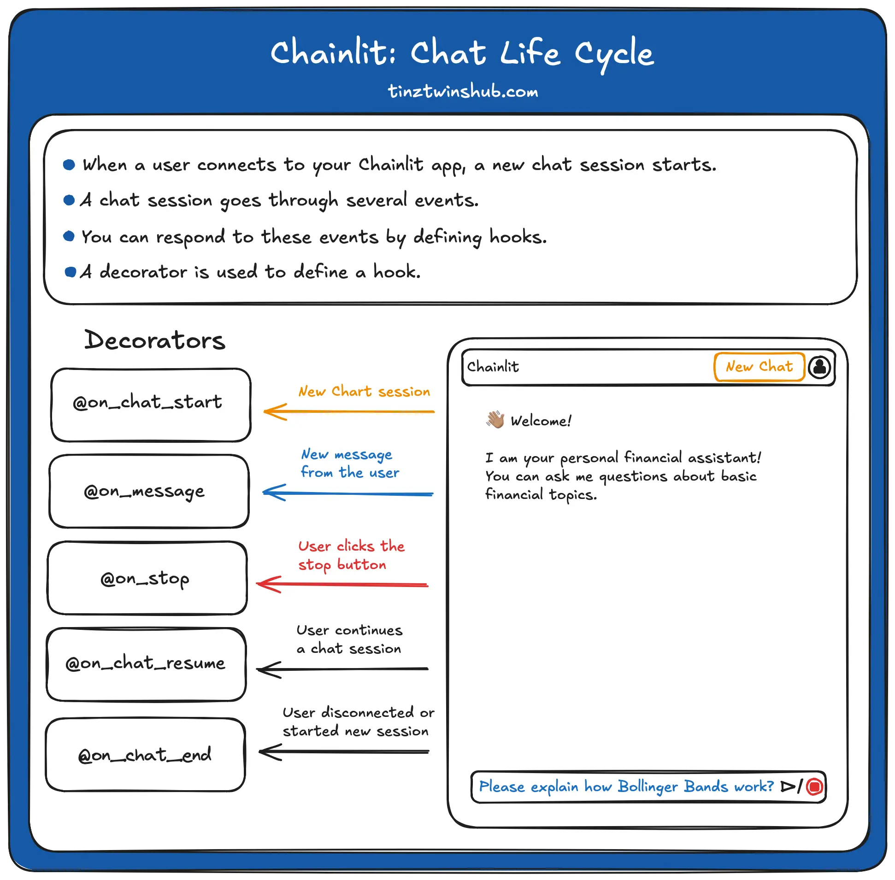

# Stateful Chatbot with Authentication

A simple Question Answering Stateful chatbot with GitHub authentication built with Python, UV, and Chainlit.



## Getting Started

### 1️⃣ Install UV

First, install **UV** (if not already installed):

```sh
curl -LsSf https://astral.sh/uv/install.sh | sh
```

For Windows:

```sh
powershell -ExecutionPolicy ByPass -c "irm https://astral.sh/uv/install.ps1 | iex"
```

Verify installation:

```sh
uv --version
```

---

### 2️⃣ Create and Initialize the Project

```sh
uv init chatbot-authentication
cd chatbot-authentication
```

---

### 3️⃣ Install Dependencies

```sh
uv add chainlit google-generativeai python-dotenv
```

---

### 4️⃣ Activate UV Virtual Environment (Windows)

```sh
.venv\Scripts\activate
```

For Linux/macOS:

```sh
source .venv/bin/activate
```

### 5️⃣ Try Chainlit Hello

Run the following command to check if Chainlit is installed and working:

```sh
chainlit hello
```

Go to the following URL:

```sh
http://localhost:8000
```

Enter your name and send the message

You should see the following output:

```sh
Your name is: Asharib / Your Name
Chainlit installation is working!
You can now start building your own chainlit apps!
```

---

### 6️⃣ Create .env file

Create a `.env` file in the root directory of the project and add the following:

```sh
GEMINI_API_KEY=your_gemini_api_key
OAUTH_GITHUB_CLIENT_ID=your_github_client_id
OAUTH_GITHUB_CLIENT_SECRET=your_github_client_secret
CHAINLIT_AUTH_SECRET=your_chainlit_auth_secret
```

Get Google Gemini API key from [here](https://aistudio.google.com/app/apikey)

Get GitHub OAuth Client ID and Client Secret from [here](https://github.com/settings/applications)

Generate chainlit auth secret with the following command:

```sh
chainlit create-secret
```

Copy the generated values and paste it in the `.env` file.

---

### 7️⃣ Create `chainlit.yaml` file

Create a `chainlit.yaml` file in the root directory of the project and add the [following code](https://github.com/AsharibAli/ramadan-coding-nights/blob/main/15_stateful_chatbot_authentication/chainlit.yaml).

---

### 8️⃣ Run Authentication Chatbot (Web App)

```sh
chainlit run main.py -w
```

Go to the following URL:

```sh
http://localhost:8000
```

***First login with GitHub, and then enter your question and send the message, and you should see the answer from the LLM, and the chatbot will remember your previous messages.***

🎉 That’s it! Your Stateful Chatbot with Authentication is ready to use 🚀
